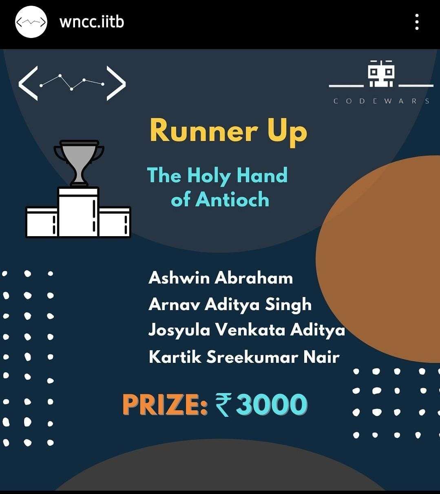

# The Holy Hand Grenade of Antioch : CodeWars v1 (Virus Wars) Runner ups

Our team is called The Holy Hand Grenade of Antioch[^1] comprised of Kartik Sreekumar Nair, Josyula Venkata Aditya, Arnav Aditya Singh and Ashwin Abraham.
We participated in CodeWars v1 (Virus Wars) coding contest conducted by WnCC IIT Bombay in 2021-22 and the bots programmed by us
came second overall.

[^1]: Since the programming was done in Python, which was named after Monty Python, we took the inspiration for our team name from [this scene](https://www.youtube.com/watch?v=xOrgLj9lOwk)

